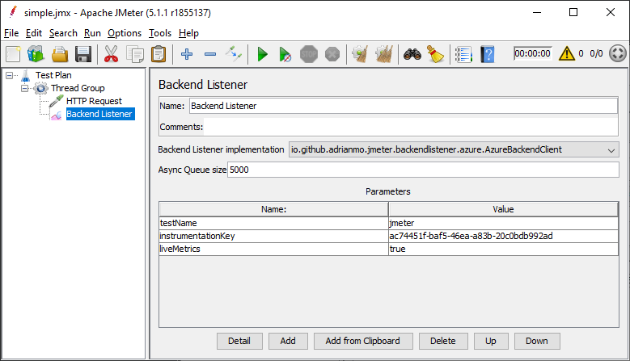
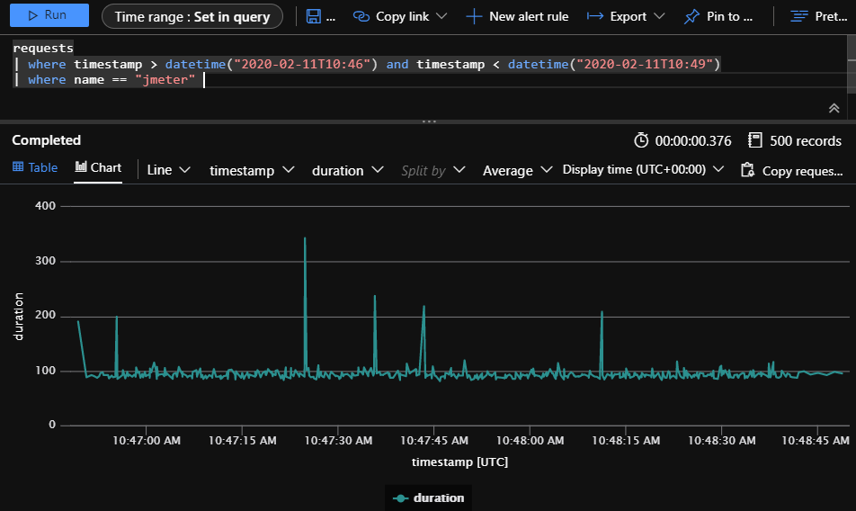
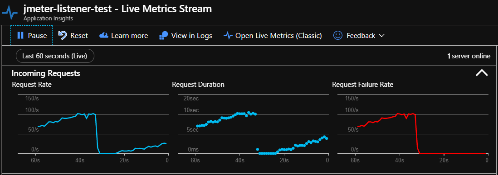

# jmeter-backend-azure

[](https://github.com/adrianmo/jmeter-backend-azure/actions/workflows/maven.yml)
[](https://github.com/adrianmo/jmeter-backend-azure/actions/workflows/maven-publish.yml)

A JMeter plug-in that enables you to send test results to Azure Application Insights.

## Overview

### Description

JMeter Backend Azure is a JMeter plugin enabling you to send test results to an Azure Application Insights.  

The following test results metrics are exposed by the plugin.

- TestStartTime
- SampleStartTime
- SampleEndTime
- ResponseCode
- Duration
- URL
- SampleLabel
- SampleCount
- ErrorCount
- Bytes
- SentBytes
- ConnectTime
- IdleTime
- ThreadName
- GrpThreads
- AllThreads
- (Optional) aih.{response_header}

### Plugin installation

Once you have built or downloaded the plugin JAR file from the [releases](https://github.com/adrianmo/jmeter-backend-azure/releases) section,
move the JAR to your `$JMETER_HOME/lib/ext`.

```bash
mv target/jmeter.backendlistener.azure-VERSION.jar $JMETER_HOME/lib/ext/
```

Then, restart JMeter and the plugin should be loaded.

### JMeter configuration

To make JMeter send test result metrics to Azure Application Insights, in your **Test Pan**, right click on 
**Thread Group** > Add > Listener > Backend Listener, and choose `io.github.adrianmo.jmeter.backendlistener.azure.AzureBackendClient` as `Backend Listener Implementation`. 
Then, in the Parameters table, configure the following attributes.

| Attribute | Description | Required |
|---|---|---|
| *connectionString* | The [Connection String](https://docs.microsoft.com/en-us/azure/azure-monitor/app/sdk-connection-string?tabs=java) of your Application Insights instance | Yes |
| *testName* | Name of the test. This value is used to differentiate metrics across test runs or plans in Application Insights and allow you to filter them. | Yes |
| *liveMetrics* | Boolean to indicate whether or not real-time metrics are enabled and available in the [Live Metrics Stream](https://docs.microsoft.com/en-us/azure/azure-monitor/app/live-stream). Defaults to `true`. | No |
| *samplersList* | Optional list of samplers separated by a semi-colon (`;`) that the listener will collect and send metrics to Application Insights. If the list is empty, the listener will not filter samplers and send metrics from all of them. Defaults to an empty string. | No |
| *useRegexForSamplerList* | If set to `true` the `samplersList` will be evaluated as a regex to filter samplers. Defaults to `false`. | No |
| *responseHeaders* | Optional list of response headers spearated by a semi-colon (`;`) that the listener will collect and send values to Application Instights. | No |
| *instrumentationKey* | The Instrumentation Key of your Application Insights instance. Deprecated: use *connectionString* instead. | No |

*Example of configuration:*



#### Custom properties

You can add custom data to your metrics by adding properties starting with `ai.`, for example, you might want to provide information related to your environment with the property `ai.environment` and value `staging`.

### Visualization

Test result metrics are available in the **requests** dimension of your Application Insights instance. 
In the image you can see an example of how you can visualize the duration of the requests made during your test run.



Additionally, if you enabled `liveMetrics` in the configuration, you can watch your test performance in real-time in the Live Metrics Stream blade.



## Contributing

Feel free to contribute by forking and making pull requests, or simply by suggesting ideas through the 
[Issues](https://github.com/adrianmo/jmeter-backend-azure/issues) section.

### Build

You can make changes to the plugin and build your own JAR file to test changes. To build the artifact, 
execute below Maven command. Make sure `JAVA_HOME` is set properly.

```bash
mvn clean package
```

---

This plugin is inspired in the [Elasticsearch](https://github.com/delirius325/jmeter-elasticsearch-backend-listener) and [Kafka](https://github.com/rahulsinghai/jmeter-backend-listener-kafka) backend listener plugins.
